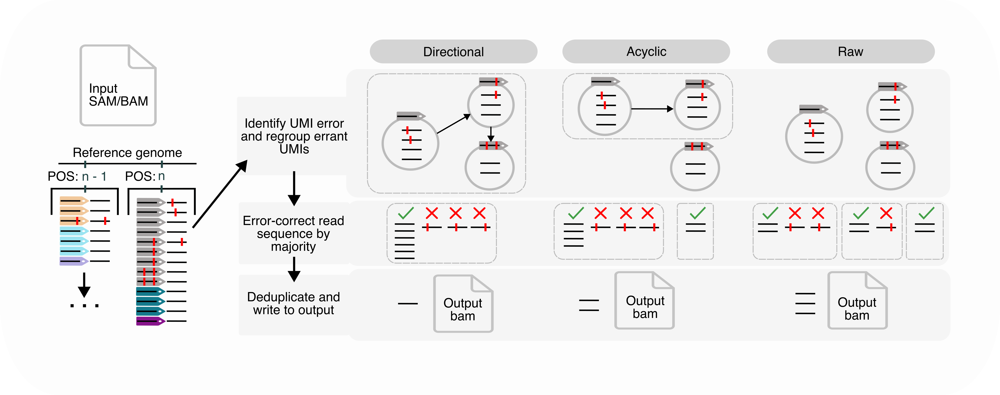
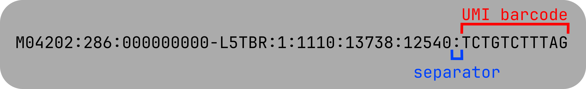

<p align="center">
    
</p>

## RUMINA - Rust-based Unique Molecular Identifier Network Analysis

RUMINA is a performant pipeline for error correction of Next-Generation Sequencing (NGS) data using Unique Molecular Identifiers (UMIs), fit for shotgun-based and amplicon-based methodologies.

RUMINA deduplicates reads associated with a single template molecule, using the coordinates of read alignment and UMI barcode sequence to perform correction of PCR and sequencing errors. The above strategy also allows for correction of errors in UMI sequences (directional clustering). 

This pipeline is tested for processing ~600 million reads in ~5 hours, at a rate of 120 million reads processed per hour (tested on 10-core M1 Max Mac Studio).


### Workflow:

<p align="center">
    
</p>


### Installation: 

dependencies: 
- [cargo](https://www.rust-lang.org/tools/install) v1.86.0+
#### option 1: install with cargo

```bash
cargo install rumina
```

#### option 2: compile from source

```bash
export RUSTFLAGS="-C target-cpu=native" 

git clone https://github.com/epiliper/rumina.git
cd rumina
cargo build --release 
mv target/release/rumina .
```

The binary will be located at `./rumina`. It's recommended that you move it somewhere to your `$PATH`, so you can run it from anywhere.  
NOTE: Using this option may yield performance gains, as the `target-cpu=native` flag is not used when making the release binaries.

#### option 3: release binaries

Navigate to releases and download the zip for your system's CPU architecture. Unzip and `cd` into the directory, and run `./rumina -h` to ensure it's working.   
It's recommended to move the binary to someplace in your `$PATH` for convenience.


### Usage: 

RUMINA currently has two subcommands: 

#### `dedup`
Deduplicate an input FASTQ or BAM file:  
`rumina dedup -i [*.bam|*.fastq|*.fastq.gz] -g {directional, acyclic, raw} -s <UMI SEPARATOR> [OPTIONS] -o [OUTDIR]`

`dedup` will write output BAM files and reports to an output directory (`rumina_output` by default), which can be specified with `--outdir`.

#### `extract`

Analogous to `umi_tools extract`, extract cell and UMI barcodes in FASTQ read sequence to read headers, given a pattern to look for.  
`rumina extract -i <FASTQ> -p <PATTERN> -o <OUTPUT> [OPTIONS]`

Run `rumina extract -h` for paired-end options.

---
###  Arguments - `dedup`


#### Required

##### `-i`
The input file or directory. If a file, it must be either BAM or FASTQ format (plaintext or gzipped): 

BAMs should have the UMI in the read QNAME field (see image under --separator, `rumina extract`). Illumina data base-called by BCL convert should be formatted this way by default. BAMs must also be sorted and indexed.

If the input is a directory, all BAM/FASTQ files within (excluding pipeline products) will be processed per the other arguments specified. 

##### `-g, --grouping-method`

Specifies how/if to merge UMIs based on edit distance, to account for PCR mutations and NGS errors in UMI sequence. Options are: 
* **directional**: Merge UMIs via directional clustering. See *Amplicon* section for more details. This is the best option for amplicon sequencing data.
* **acyclic**: Same as directional clustering, except UMI networks are limited to a depth of 1, i.e. UMIs that are predicted children cannot have UMIs as child nodes.
* **raw**: Treat each UMI as genuine; UMIs are not merged. This is the best option if you suspect UMI errors are not present, or are concerned about UMI over-grouping.

##### `-s, --separator`
Specifies the character in the read QNAME delimiting the UMI barcode from the rest of the string. This is usually `_` or `:`.<br>

<p align="center">
    
</p>


#### Performance

##### `-x, --split-window` (default = None)
Dictates how to split input BAM files into subfiles (for avoiding memory overflow). 
This is usually necessary for BAM files with high sequencing depth that would otherwise cause the program to overuse available memory.

Splitting happens along coordinates of the reference genome in the specified BAM file; If `--split_window 100` was used, reads for every 100bp stretch of the reference would be processed in separate batches, prior to being written to output. This applies to every reference genome present in the input alignment.

Options are: 
* **positive integer**: split input files by a fixed window size. If `input` is a directory, this will be applied to each file within the directory. This has been tested with values ranging from 50 - 500.
* **none** (default): process the input as one file without splitting by coordinate window. Using this option with larger BAMs may result in memory overuse.

##### `-t, --threads` (default = all) 

Specifies the number of threads RUMINA is allowed to use. Threads are used to parallelize processing of individual reference coordinates, and for I/O operations. 

By default, RUMINA will attempt to use all available threads.

#####  `--strict-threads` (optional)

Restrict BAM reading and writing operations to use the same number of threads as `--threads`. May slow down IO operations if using fewer threads than available on your machine, but makes CPU usage more predictable.

##### `--ensure-sorted` (optional)

Only relevant if using nonzero `-x` / `--split_window`. Retains all window output reads in a buffer before writing, to ensure output file is sorted. 

#### Grouping - general

##### `-l, --length` (optional)
if used, groups reads by length as well as coordinate. This is recommended for metagenomics data with high read depth, as this will group reads more stringently and likely produce more singleton groups. 

##### `--only-group` (optional)
if used, reads will be grouped (assigned a group-specific "UG" tag), but not deduplicated or error-corrected. This is useful if you want to manually check how grouping works with a given file.


#### Grouping - advanced

##### `--percentage` (default = 0.5)
The maximum fraction of reads one UMI (a) must have relative to another UMI (B) to be considered its offshoot, such that b -> a.

##### `--max-edit` (default = 1)

The maximum edit distance between two UMIs for them to be clustered. Should two UMIs meet this criterion, the parent will be the one with the higher count

#### Miscellaneous

##### `--outdir` (default = rumina_output)
The output directory, inside the parent directory of the input files/directory, in which RUMINA's output will be stored. It will be created if it doesn't exist.

Example: 
```bash
$INPUT_FILE=/home/stuff/test.bam
$OUTDIR=temp
# outfiles will be stored in /home/stuff/temp
```

#### Arguments for paired-end input


##### `--paired` (optional)

Use only R1 for deduplication, pairing deduplicated R1s with their associated R2s in the final output. This is similar to UMI-tools, in that R2 reads are not part of UMI clusters.

##### `--merge-pairs` (optional)
Use both R1 and R2 for deduplication, and merge overlapping forward/reverse reads with the same barcode after initial deduplication. Merged reads are then realigned to the reference genome, which should be supplied in FASTA format. This is untested with segmented genomes or eukaryotic genomes, and is under active development.

Forward/reverse pairs are merged only if they contain a minimum number of overlapping bases, which is controlled by the `--min_overlap_bp` argument. Forward/reverse pairs identified to have discordant sequences are discarded, and reads unable to be merged for other reasons are still written to output.

This option is currently only compatible with single-reference BAM files (you can only specify one reference for this argument), and this mode uses more memory than `--paired`.

##### `--min-overlap-bp` (default = 3)
The minimum number of bases shared by two reads at the same reference coordinates for merging to occur in `--merge_pairs`. Reads not discordant in sequence but not meeting this threshold will not be merged, and instead both be written to the output file.

### Arguments - `extract`

Note: extraction works by supplying a pattern of bases to recognize and copy from the read. Currently only extraction from the 5' end is supported.

Patterns are much like their counterparts in `umi-tools extract`, comprised solely of three characters:
- C: base is part of cell barcode
- X: base is irrelevant (don't extract it, leave it as is)
- N: base is part of UMI barcode

For example, given a read header and sequence:
```
@SRR29694476.1 VH01584:30:AAFKFNKM5:1:1101:41863:1000 length=151
GTTCCCGACCGTGCGCATGAAGATGGAAGCCGGTAACGGCTCCACCGAAGACTTGACCGGTCGTGTGATCGATCTCTGCGCTCCGATCGGCAAAGGCCAGCGTGGCCTGATCGTCGCACCGCCGAAAGCCGGCAAGACCATCATGCTGCAG
```

Say you supply a pattern `NNXXXXNNCC` (2 UMI bases, followed by 4 misc bases, then 2 UMI bases, then 2 cell barcode bases):

The read after being processed with `rumina extract` will be (note the header):
```
@SRR29694476.1_CC_GTGA VH01584:30:AAFKFNKM5:1:1101:41863:1000 length=151
TCCCGTGCGCATGAAGATGGAAGCCGGTAACGGCTCCACCGAAGACTTGACCGGTCGTGTGATCGATCTCTGCGCTCCGATCGGCAAAGGCCAGCGTGGCCTGATCGTCGCACCGCCGAAAGCCGGCAAGACCATCATGCTGCAG
```

The two bases of the cell barcode come first (CC), followed by the 4 bases of the UMI barcode (GTGA):

```
first 10 bases of read: GTTCCCGACC
selected by pattern:    NN....NNCC
=====
UMI:                    GT....GA.. = GTGA
Cell barcode:           ........CC = CC
```

Note that selected UMI and cell barcode bases were removed from the read sequence. These bases can be preserved by using `--retain-seq`.


##### `-i` 
first FASTQ input. Must end in .fastq or .fastq.gz.
##### `-I`
second FASTQ input. Must end in .fastq or .fastq.gz.

##### `-o`
first FASTQ output. Must end in .fastq or .fastq.gz.

##### `-O` 
second FASTQ output. Must end in .fastq. or .fastq.gz.

##### `-p` 
extraction pattern for file given with -i.

##### `-P` 
extraction pattern for file given with -I.

##### `-s` (default = '_') 
character to use to delimit barcodes from each other and read header.

##### `--retain-seq` 
don't remove barcode bases from read sequences during extraction.
Barcode sequence will be in both the read header and sequence.

##### `--mask-qual` 
replace any UMI barcode bases below this quality with 'N'.

##### `--quality-filter` 
don't output reads with UMIs with base(s) below this quality.
In paired-end data, if one mate fails this filter, the other will be removed.

##### `-e/--qual-encoding`
quality encoding to use for filtering/masking.
Choose from "phred33", "phred64", or "solexa".

##### `-b/--batch-size` (default = 10,000)
number of reads to buffer before writing.

##### `-t/--threads` (default = # of system threads)
number of threads to use for compression/parallel extraction.

## TODO:
- Support reading from STDIN and writing to STDOUT
- Asynchronous write/read for `rumina dedup`
- (Maybe) explore parallel-friendly BK-tree?
